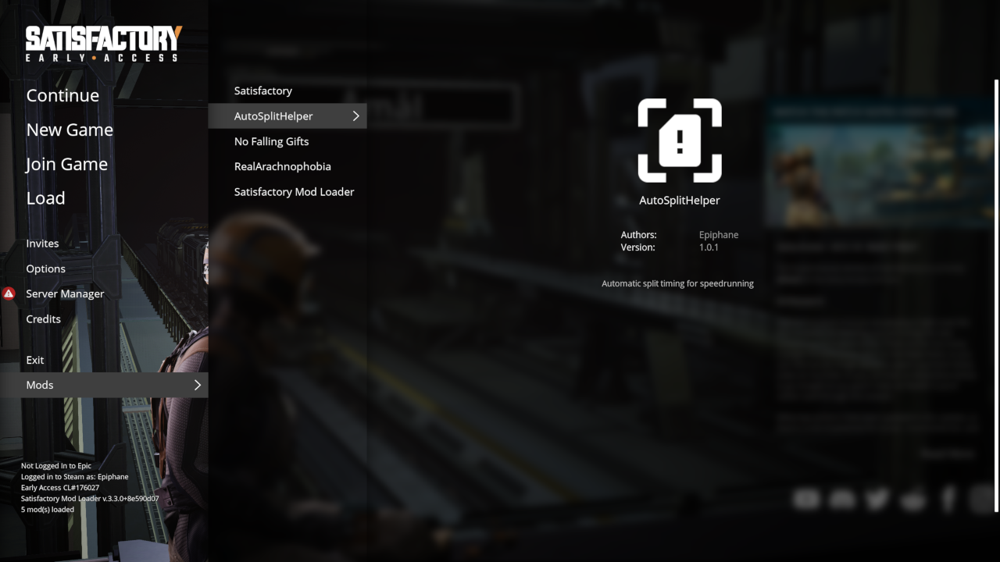
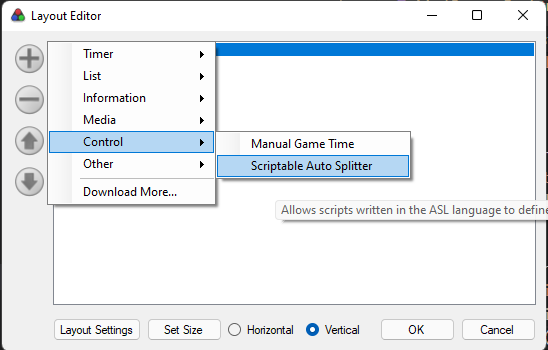
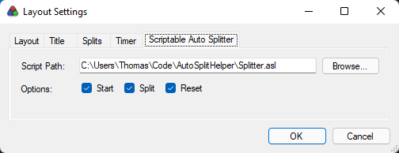

# AutoSplitHelper

This mod adds extra event logging to Satisfactory's main output, which can be used by autosplitters to trigger clock events. The extra log options are all findable by searching for "LogAutoSplitHelper" in your game logs, and will report:

- Intro is over (start the timer)
- HUB Upgrade purchases
- Space elevator submissions
- Game session exits (reset/pause)

# Installing

To use AutoSplitHelper, there is a two-part install. The first will get you the Satisfactory Mod, which enables generic AutoSplit scripting, and the second is a premade AutoSplit script that you can use to get running right away (but is much easier to modify, if you want something different)

## Game Mod

To use AutoSplitHelper in game, install [Satisfactory Mod Manager](https://ficsit.app/). One you have the mod manager installed and set up, simply go to the [AutoSplitHelper mod page](https://ficsit.app/mod/BUkTADt5ohiRo6) or search for AutoSplitHelper in the app and download it.

If all goes well, you should see a Mods option on the main menu, and AutoSplitHelper should show up there:

## ASL Script

This is the what LiveSplit uses to receive the events sent by the game. A simple starter, called [`Splitter.asl`](./Splitter.asl), is available in this repository to use. The easiest way to install it is to download the file directly, and then modify your layout in LiveSplit as follows:

1. Ensure your splits have 8 phases (default Package% setup) 

2. Select "Edit Layout..."
3. Click the (+) icon, then Control > Scriptable Auto Splitter 

4. Open "Layout Settings", then "Scriptable Auto Splitter"
5. Browse for the path where you downloaded Splitter.asl

# Discord Server
Join the [Satisfactory Speedrunning discord](https://discord.gg/qD6CpuB5) to talk about speedrunning, ask questions, and provide any feedback you have!

# Contributing

I'm a human, with a human life and human needs. I'l happily respond to issues and review pull requests when I can, but I have other things to do than mod Satisfactory. Please be patient with me or reach out via Discord (Epiphane#6997, or the server linked above) if you have concerns, feedback, or questions :)
